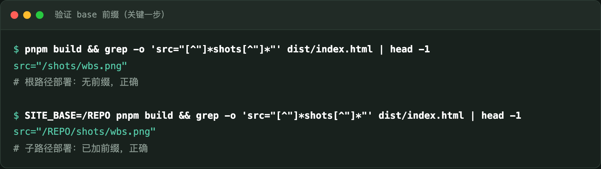
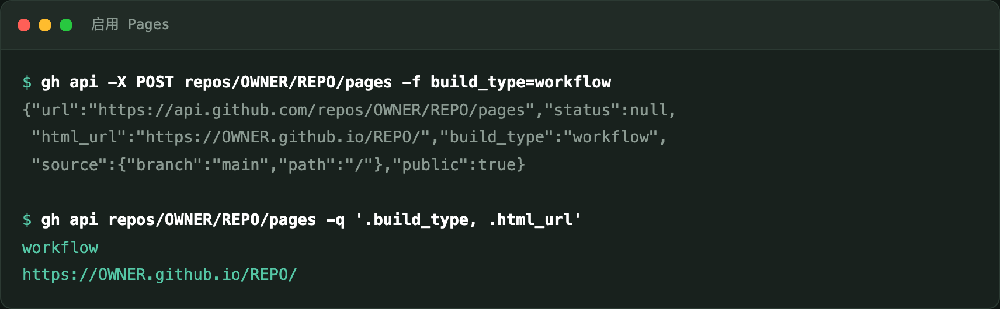
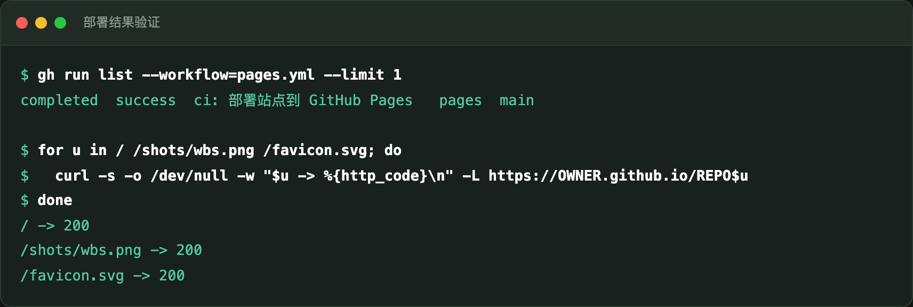

# 用 gh 命令行把静态站点部署到 GitHub Pages

全程命令行，不点一次网页设置。适用于 Astro / Vite / Next 静态导出等任何产出
静态文件的项目。

本文记录的是一次真实配置的完整过程，包括**中途踩到的坑**——那个坑不解决，
站点会部署成功但图片全部 404。

---

## 结论先行

三条命令加一个工作流就能完成：

```bash
# 1. 启用 Pages，把发布源设为 GitHub Actions
gh api -X POST repos/OWNER/REPO/pages -f build_type=workflow

# 2. 提交部署工作流（内容见下文）
git add .github/workflows/pages.yml && git commit -m "ci: 部署到 Pages" && git push

# 3. 验证
gh run list --workflow=pages.yml --limit 1
```

但在此之前，**必须先确认站点能在子路径下正常工作**。这是最容易翻车的地方，
放在第 2 节讲。

---

## 1. 前置条件

| 项 | 要求 | 检查方式 |
|---|---|---|
| 仓库可见性 | 公开，或付费账户的私仓 | `gh api repos/OWNER/REPO -q .visibility` |
| gh 权限 | 含 `repo` scope | `gh auth status` |
| 站点 | 能产出纯静态文件 | 本地 `pnpm build` 有 dist/ |

> **私有仓库注意**：Free 账户的私仓**无法**启用 Pages，需要 Pro 及以上。
> 如果 `gh api -X POST .../pages` 返回 404 或 403，先确认这一点。

公开仓库还有个附带好处：GitHub 托管的标准 runner 对公开仓库免费，
不消耗 Actions 额度。

---

## 2. 先解决子路径问题（否则白干）

**这是本文最重要的一节。**

GitHub Pages 把项目站点放在 `https://OWNER.github.io/REPO/` —— 注意末尾的
`/REPO/`。也就是说你的站点运行在**子路径**下，而不是根路径。

如果你的模板里写了绝对路径：

```html

<link rel="icon" href="/favicon.svg">
```

部署后浏览器会去请求 `https://OWNER.github.io/shots/wbs.png`——**少了 `/REPO`
前缀，全部 404**。页面能打开，但图全裂。

构建工具**不会**自动帮你加这个前缀。Astro 的 `base` 配置只影响它自己生成的
资源引用（如打包后的 CSS/JS），你手写在模板里的绝对路径它不碰。

### 做法：让 base 可配置

同一份代码往往要部署到多处（比如自有服务器在根路径、Pages 在子路径），
所以不要写死，从环境变量取：

```js
// astro.config.mjs
import { defineConfig } from "astro/config";
import process from "node:process";

const site = process.env.SITE_URL ?? "https://example.com";
const base = process.env.SITE_BASE ?? "/";

export default defineConfig({ site, base, output: "static" });
```

模板里用一个助手拼接资源路径：

```astro
---
// BASE_URL 由 Astro 根据 base 注入，结尾可能带 /，统一处理一次
const asset = (p) =>
  `${import.meta.env.BASE_URL.replace(/\/$/, "")}/${p.replace(/^\//, "")}`;
---

<link rel="icon" href={asset("favicon.svg")} />

```

> Vite/React 用 `import.meta.env.BASE_URL`，Next.js 用 `basePath` +
> `assetPrefix`，原理相同：**别写死绝对路径**。

### 部署前先在本地验证

不要等推上去才发现问题，两条命令就能验证：



根路径构建出 `/shots/wbs.png`，子路径构建出 `/REPO/shots/wbs.png`——
两种都对，才能往下走。

---

## 3. 启用 Pages

`gh` 没有专门的 pages 子命令，用 `gh api` 调 REST 接口。关键是
`build_type=workflow`，表示由 Actions 部署，而不是传统的"从某个分支目录发布"。

```bash
gh api -X POST repos/OWNER/REPO/pages -f build_type=workflow
```



返回里确认两个字段：

- `"build_type": "workflow"` —— 发布源是 Actions
- `"html_url"` —— 站点地址，形如 `https://OWNER.github.io/REPO/`

已经启用过想改配置的话，用 `PUT`：

```bash
gh api -X PUT repos/OWNER/REPO/pages -f build_type=workflow
```

---

## 4. 部署工作流

```yaml
name: pages

on:
  push:
    branches: [main]
    # 只有站点本身变了才重新发布，避免无关改动触发
    paths:
      - "site/**"
      - ".github/workflows/pages.yml"
  workflow_dispatch:

permissions:
  contents: read
  pages: write
  id-token: write # deploy-pages 用 OIDC，必需

# Pages 同时只允许一个部署；排队而不是取消，避免发布到一半被打断
concurrency:
  group: pages
  cancel-in-progress: false

jobs:
  build:
    runs-on: ubuntu-latest
    steps:
      - uses: actions/checkout@v7
      - uses: pnpm/setup@v2
        with:
          runtime: node@24
          install: false

      - name: Install deps
        working-directory: site
        run: pnpm install --frozen-lockfile

      - uses: actions/configure-pages@v6
        id: pages

      - name: Build
        working-directory: site
        env:
          # configure-pages 直接给出 base_path，即 /REPO
          SITE_BASE: ${{ steps.pages.outputs.base_path }}
          SITE_URL: ${{ steps.pages.outputs.origin }}
        run: pnpm build

      - uses: actions/upload-pages-artifact@v5
        with:
          path: site/dist

  deploy:
    needs: build
    runs-on: ubuntu-latest
    environment:
      name: github-pages
      url: ${{ steps.deploy.outputs.page_url }}
    steps:
      - id: deploy
        uses: actions/deploy-pages@v5
```

### 三个容易写错的点

**`id-token: write` 不能省。** `deploy-pages` 用 OIDC 换取部署令牌，缺了会
以权限错误失败，而报错信息不会直接告诉你少了哪个权限。

**`concurrency` 要用 `cancel-in-progress: false`。** Pages 同一时刻只接受一个
部署。设成 `true` 的话，连续两次推送会让前一次部署被中途取消，可能留下不一致
的状态。

**别照抄版本号。** action 的主版本号和它的 Node 运行时**不是一回事**。
GitHub 正在弃用 Node 20，升级时应逐个核对：

```bash
gh api repos/OWNER/REPO/contents/action.yml?ref=TAG -q '.content' \
  | base64 -d | grep -E "^\s*using:"
```

我写这篇时实测：`configure-pages` 最新是 v6、`upload-pages-artifact` 是 v5、
`deploy-pages` 是 v5——三者主版本号各不相同，凭印象写必错。

---

## 5. 验证

推送后跟踪构建，然后**逐个资源验证**，而不是只看首页能打开：



首页返回 200 只能说明站点起来了。**图片和 favicon 也必须逐个查**——
子路径配错时，恰恰是首页正常而资源全 404。

再确认页面里的路径确实带上了前缀：

```bash
curl -sL https://OWNER.github.io/REPO/ | grep -oE 'src="[^"]*"' | head -3
# 期望看到 src="/REPO/..." 而不是 src="/..."
```

---

## 6. 排错

| 症状 | 原因 | 处理 |
|---|---|---|
| 页面能开，图全裂 | 资源写死绝对路径 | 见第 2 节，用 BASE_URL 拼接 |
| `POST /pages` 返回 404/403 | 私仓 + Free 账户 | 转公开或升级套餐 |
| deploy 步骤权限错误 | 缺 `id-token: write` | 补上该权限 |
| 首次访问 `ERR_CONNECTION_CLOSED` | CDN 尚未生效 | 等 1–2 分钟；用 `curl` 二次确认再下结论 |
| 工作流没触发 | `paths` 过滤没命中 | 检查改动路径，或用 `workflow_dispatch` 手动跑 |

> 最后一条我实际遇到过：浏览器自动化访问时连接被断，但同一台机器 `curl`
> 全部 200。**不要因为一个工具失败就断定站点有问题**，换个方式交叉验证。

---

## 7. 常用命令速查

```bash
# 查看 Pages 配置
gh api repos/OWNER/REPO/pages -q '.build_type, .html_url, .status'

# 手动触发部署
gh workflow run pages.yml

# 跟踪最近一次部署
gh run watch "$(gh run list --workflow=pages.yml --limit 1 \
  --json databaseId --jq '.[0].databaseId')" --exit-status

# 看失败日志
gh run view --log-failed

# 关闭 Pages
gh api -X DELETE repos/OWNER/REPO/pages
```

---

## 附：自定义域名

想用自己的域名而非 `OWNER.github.io/REPO`：

```bash
gh api -X PUT repos/OWNER/REPO/pages -f cname=www.example.com
```

DNS 侧加 CNAME 指向 `OWNER.github.io`。注意用了自定义域名后站点在**根路径**，
此时 `SITE_BASE` 应设回 `/`——`configure-pages` 会自动处理，但如果你手工写死
了 base，记得改。
